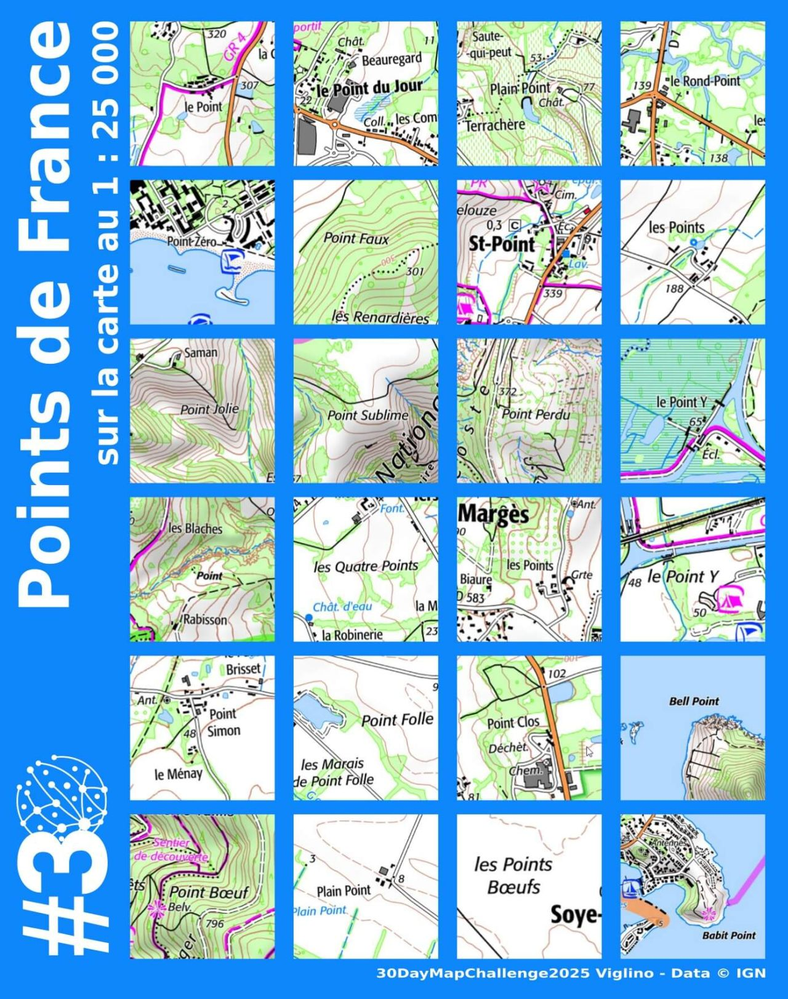

# Day 1 - Points

🧭 Les Points de France sur la carte IGN.
De Saint-Point (Saône-et-Loire) au Point Sublime (Hérault), à la recherche du Point Perdu (Ardèche)...

{: .center }
{:width="550px"}{: .fullscreen }    
{:width="550px"}{: .fullscreen }    
[Voir la carte en ligne](https://macarte.ign.fr/carte/c2B8A9/Les-Points-de-France){:target="macarte"}

{: .center }
[{:width="40px"}](https://x.com/jmviglino/status/1984987065268703688) - [{:width="40px"}](https://bsky.app/profile/jmviglino.bsky.social/post/3m4novfvyws2a) - [{:width="40px"}](https://www.linkedin.com/posts/jean-marc-viglino-87826b14b_30daymapchallenge-pointdujour-activity-7390752394789433344-BO20/)
