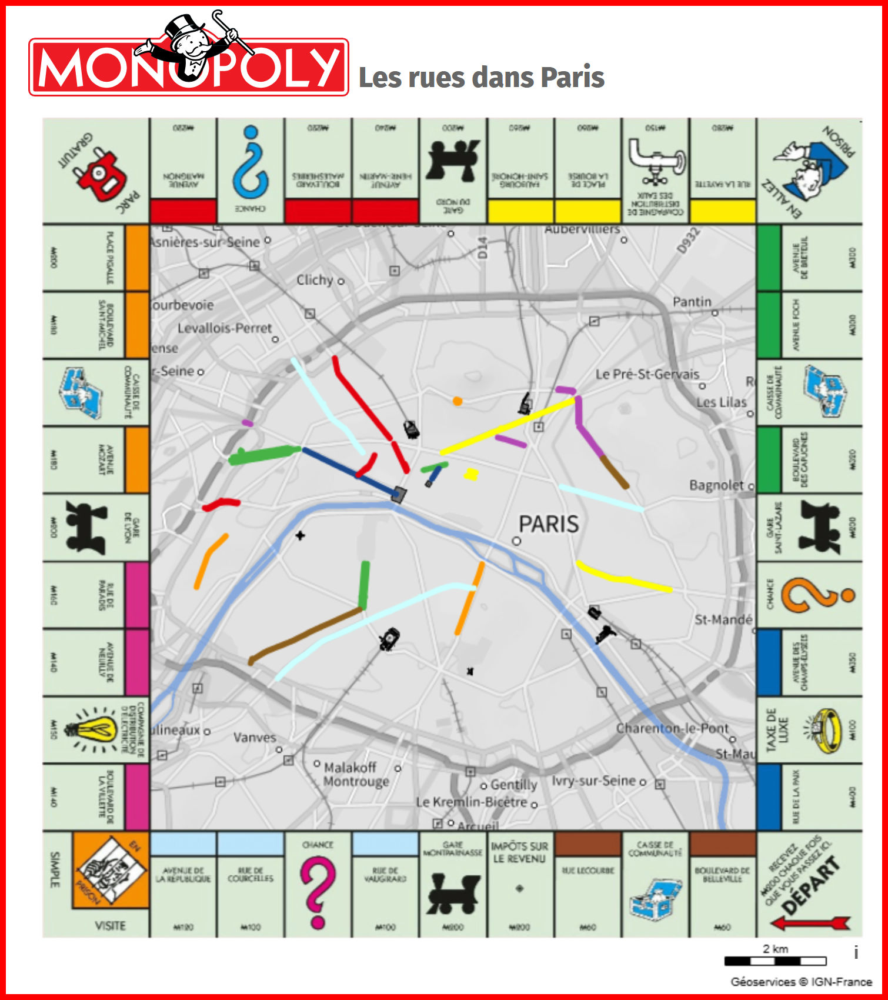

# Day 11 - Minimal map

🗺️LA carte du #Monopoly avec les places dans Paris #BDTopo.
💡à l'origine, Elizabeth Magie invente le jeu pour montrer la « nature antisociale du monopole sur le sol » 🤔 

{: .center }
{:width="550px"}{: .fullscreen }    
[Voir la carte en ligne](https://macarte.ign.fr/carte/qulkYT/Monopoly){:target="macarte"}

<iframe width="560" height="560" src="https://youtube.com/embed/xYI84ah7q7M" title="#30DayMapChallenge" frameborder="0" allow="accelerometer; autoplay; clipboard-write; encrypted-media; gyroscope; picture-in-picture; web-share" referrerpolicy="strict-origin-when-cross-origin" allowfullscreen style="margin: auto"></iframe>

{: .center }
[{:width="40px"}](https://x.com/jmviglino/status/1988199351383191869) - [{:width="40px"}](https://bsky.app/profile/jmviglino.bsky.social/post/3m5dxz3vmqs2a) - [{:width="40px"}](https://www.linkedin.com/posts/jean-marc-viglino-87826b14b_30daymapchallenge-bdtopo-activity-7393920476009426944-ahcu/)
