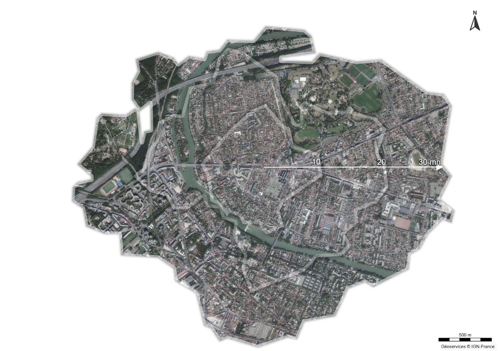

# Day 13 - 10 minutes map

⏱️ hashtag#Macarte à moins de 10 mn en moins de 10 mn.
Calcul des isochrones avec les #Geoservices de IGN (Institut national de l'information géographique et forestière) et affichage dans #Macarte (options ✂️ masque et découpage des calques). #IGNData

{: .center }
{:width="550px"}{: .fullscreen }    
[Voir la carte en ligne](https://macarte.ign.fr/carte/ZbJedF/Isochrones){:target="macarte"}

{: .center }
[{:width="40px"}](https://x.com/jmviglino/status/1988905226066157578) - [{:width="40px"}](https://bsky.app/profile/jmviglino.bsky.social/post/3m5iuvhfoh22e) - [{:width="40px"}](https://www.linkedin.com/posts/jean-marc-viglino-87826b14b_30daymapchallenge-macarte-geoservices-activity-7394670208013197312-ekaQ/)
