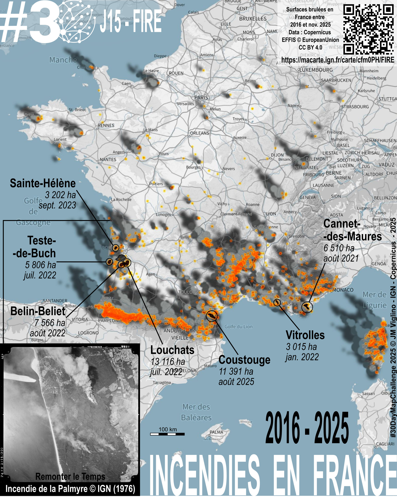

# Day 15 - Fire

🚒 La carte des feux 🌲🌳🔥𖣂 2016 à 2025 avec European Commission - European Parliament - IGN (Institut national de l'information géographique et forestière) - Copernicus EMS
🔥 Entre 2016 et 2025, plusieurs feux de forêts ont touché la France hexagonale et la Corse. 
📊 Les surfaces parcourues par les incendies de forêts en 2022 montrent un pic exceptionnel, avec 74 598 hectares de surfaces brûlées, contre 20 664 en 2017 et 44 753 depuis le début de l'année.
🎁 Et en #bonus retrouvez les feux par années, les zones brûlées et les feux historiques en France sur la carte en ligne 🗺️ #storymap ✨ #Macarte 🔥 #fire in France 2016-2025
🌐 Data European Forest Fire Information System - EFFIS

{: .center }
{:width="550px"}{: .fullscreen }    
[Voir la carte en ligne](https://macarte.ign.fr/carte/cfm0PH/Day-15-Fire){:target="macarte"}

{: .center }
[{:width="40px"}](https://x.com/jmviglino/status/1989621207214498073) - [{:width="40px"}](https://bsky.app/profile/ignfrance.bsky.social/post/3m5nljgsvms2g) - [{:width="40px"}](https://www.linkedin.com/posts/jean-marc-viglino-87826b14b_30daymapchallenge-fire-bonus-activity-7395392209866432512-mOLH/)
