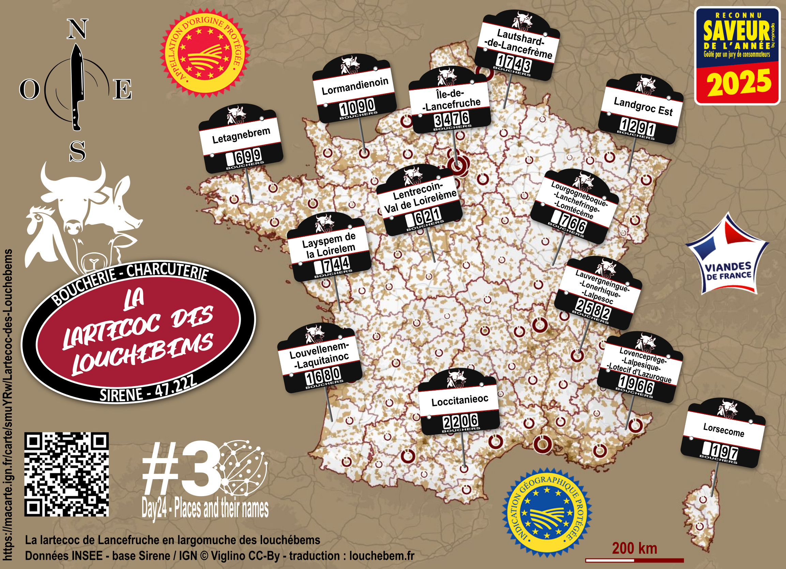

# Day 24 - Places and their names

**LA lartecoc* des louchébems ! 🐮**

Celle que vous attendiez tous ❗    
⁉️ Quel est le point commun entre "loufoque", "en loucedé", "larfeuille" et les communes sur cette carte ?    
✅ C'est du largonji louchébem ! le jargon des bouchers parlé par les bouchers parisiens et lyonnais dans la première moitié du XIXs...     
🐑 Ca coûte pas lerche et c'est pas pour les locdus !    
🔪 Données Insee - Sirene (44.22Z) et IGN (Institut national de l'information géographique et forestière).

🎁 La carte interactive pour tout savoir (avec une p'tite lansonchouille en bonus)

{: .center }
{:width="550px"}{: .fullscreen }    
[Voir la carte en ligne](https://macarte.ign.fr/carte/smuYRw/Lartecoc-des-Louchebems){:target="macarte"}

{: .center }
[{:width="40px"}](https://x.com/jmviglino/status/1986882318464581895) - [{:width="40px"}](https://bsky.app/profile/jmviglino.bsky.social/post/3m6egowtx422m) - [{:width="40px"}](https://www.linkedin.com/posts/jean-marc-viglino-87826b14b_30daymapchallenge-activity-7398628638277025792-loXC/)
