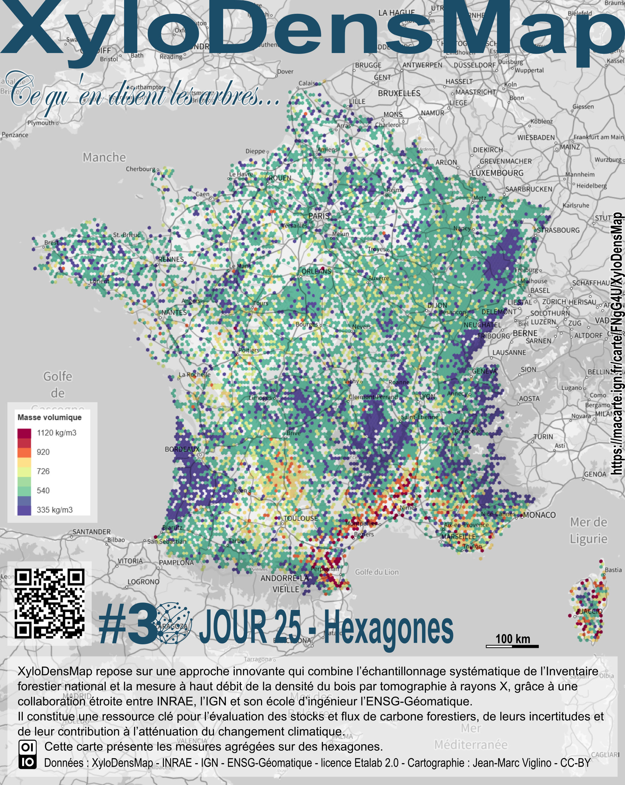
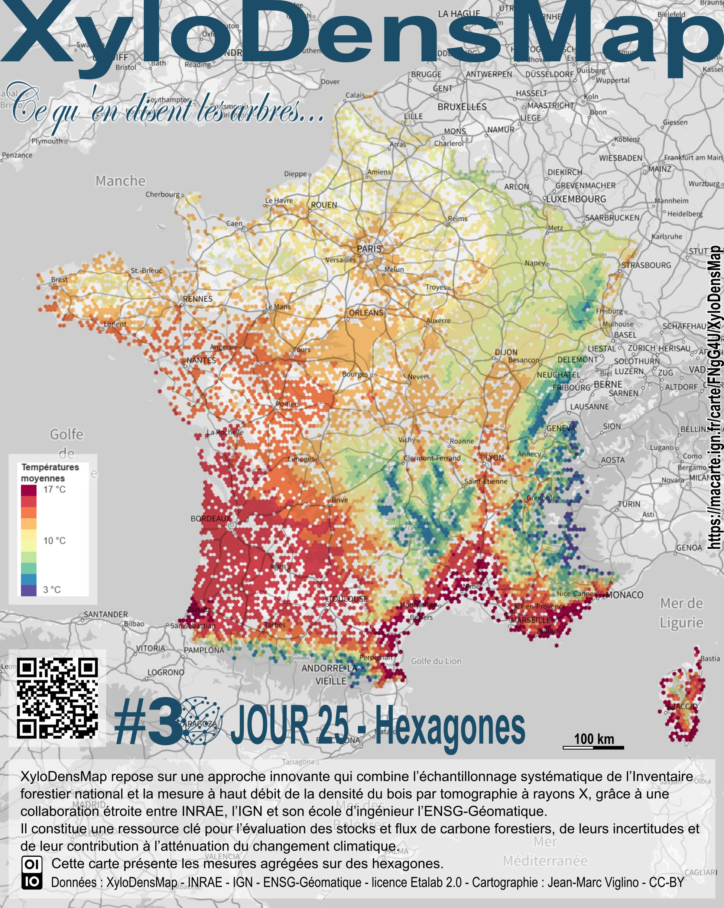
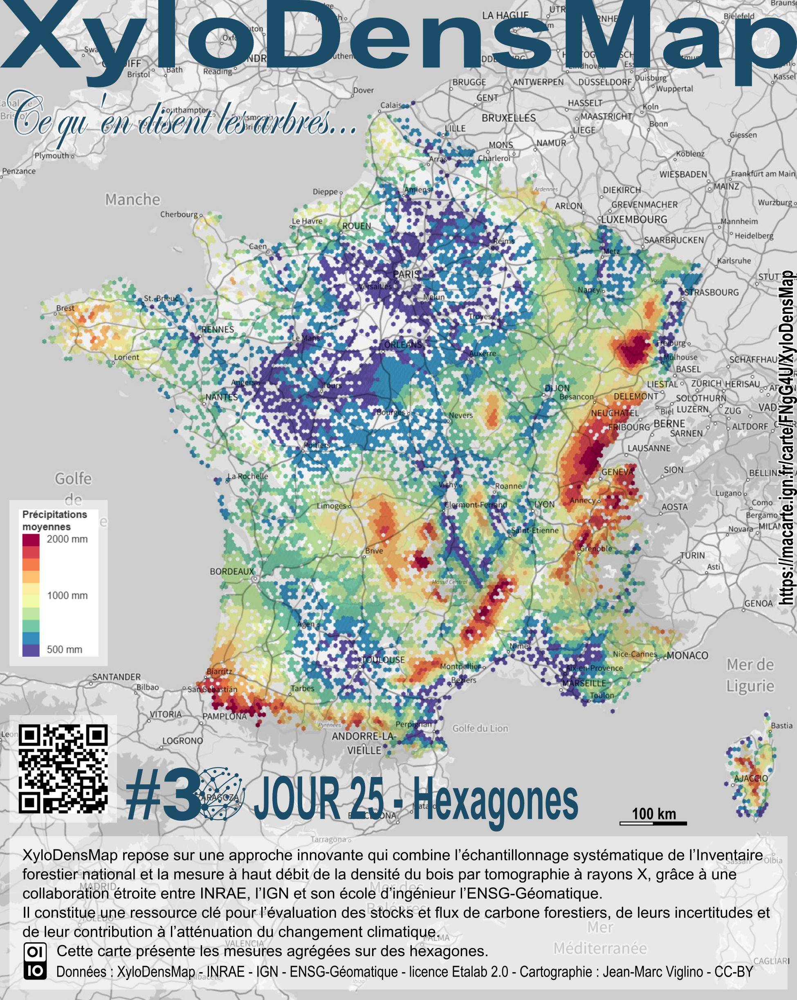

# Day 25 - Hexagons

*Ce qu'en disent les arbres* : les mesures de XyloDensMap agrégées à l'hexagone.   
XyloDensMap est un projet INRAE, IGN (Institut national de l'information géographique et forestière) et Ecole nationale des Sciences géographiques.    
Ce jeu de données permet d'évaluer la production de biomasse forestière et les aptitudes technologiques du bois produit sur le territoire hexagonal. Les applications sont multiples pour la recherche, la gestion forestière et la comptabilité carbone. 

🌳 [Source de données](https://entrepot.recherche.data.gouv.fr/dataset.xhtml?persistentId=doi:10.57745/FA9DRA)
📰 [Article scientifique](https://www.nature.com/articles/s41597-025-04645-1)

{: .center }
{:width="550px"}{: .fullscreen }    
[Voir la carte en ligne](https://macarte.ign.fr/carte/FNgG4U/XyloDensMap){:target="macarte"}

{: .center }
{:width="260px"}{: .fullscreen } {:width="260px"}{: .fullscreen }       

{: .center }
[{:width="40px"}](https://x.com/jmviglino/status/1993350258831802380) - [{:width="40px"}](https://bsky.app/profile/jmviglino.bsky.social/post/3m6hpstfok22d) - [{:width="40px"}](https://www.linkedin.com/posts/jean-marc-viglino-87826b14b_30daymapchallenge-macarte-activity-7398991342229581825-kvhE)
