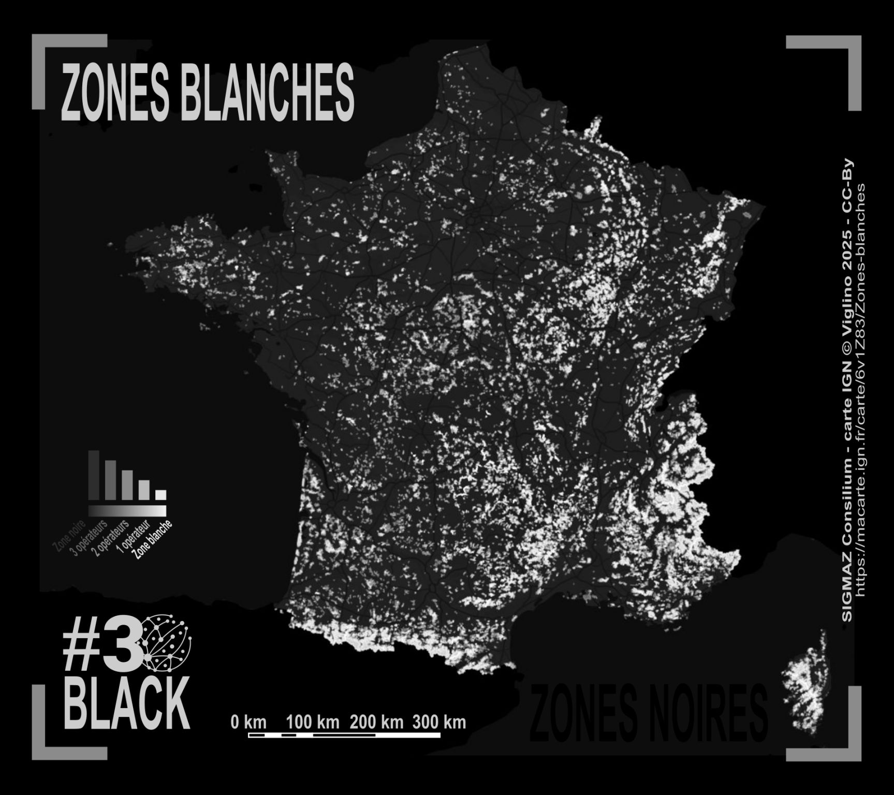

# Day 28 - Black

📵 La carte des zones blanches (et donc des zones noires)    
Données SIGMAZ Consilium 

{: .center }
{:width="550px"}{: .fullscreen }    
[Voir la carte en ligne](https://macarte.ign.fr/carte/6v1Z83/Zones-blanches){:target="macarte"}

{: .center }
[{:width="40px"}](https://x.com/jmviglino/status/1994389231389884574) - [{:width="40px"}](https://bsky.app/profile/jmviglino.bsky.social/post/3m6owhfagzs24) - [{:width="40px"}](https://www.linkedin.com/posts/jean-marc-viglino-87826b14b_30daymapchallenge-macarte-activity-7400066806301761536-0i5u)
