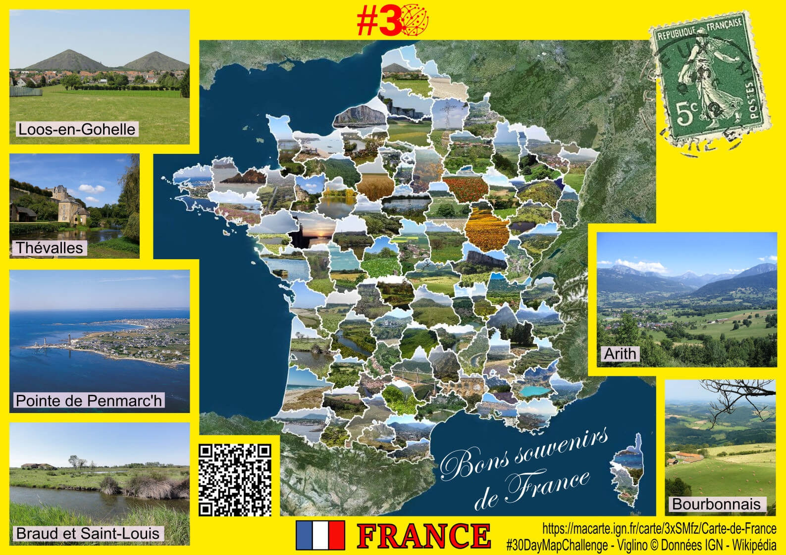
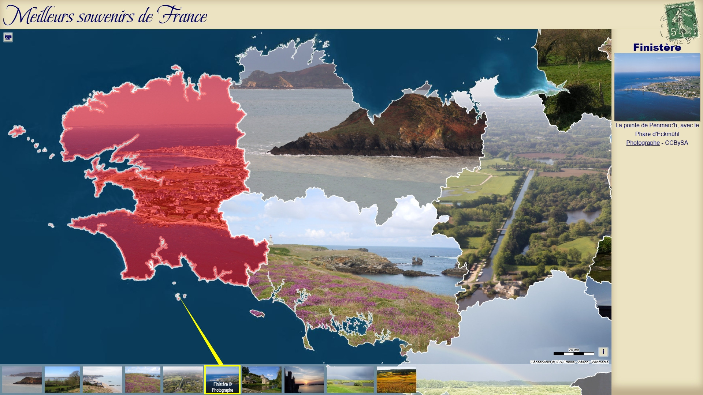

# Day 3 - Polygons

Une p'tite carte (postale) de France en photos découpées par les polygones des départements 📸
📸 Photos : contributeurs Wikipédia

{: .center }
{:width="550px"}{: .fullscreen }    
{:width="550px"}{: .fullscreen }    
[Voir la carte en ligne](https://macarte.ign.fr/carte/c2B8A9/Les-Points-de-France){:target="macarte"}

{: .center }
[{:width="40px"}](https://x.com/jmviglino/status/1985368933327945972) - [{:width="40px"}](https://bsky.app/profile/jmviglino.bsky.social/post/3m4qdopjuic2m) - [{:width="40px"}](https://www.linkedin.com/posts/jean-marc-viglino-87826b14b_30daymapchallenge-activity-7391133175046963200-18mz/)
