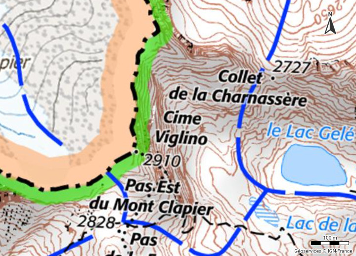

# Day 4 - My data

Mon nom est sur une carte !

{: .center }
{:width="550px"}{: .fullscreen }    
[Voir la carte en ligne](https://www.geoportail.gouv.fr/carte?c=7.427362,44.11312100000001&z=17&l0=ORTHOIMAGERY.ORTHOPHOTOS::GEOPORTAIL:OGC:WMTS(1)&l1=GEOGRAPHICALGRIDSYSTEMS.MAPS.SCAN25TOUR.CV::GEOPORTAIL:OGC:WMTS(1)&permalink=yes){:target="macarte"}

{: .center }
[{:width="40px"}](https://x.com/jmviglino/status/1986882318464581895) - [{:width="40px"}](https://bsky.app/profile/jmviglino.bsky.social/post/3m52tpcg3lc2j) - [{:width="40px"}](https://www.linkedin.com/posts/jean-marc-viglino-87826b14b_30daymapchallenge-toponymie-viglino-activity-7392648652739067904-hiwr/)
